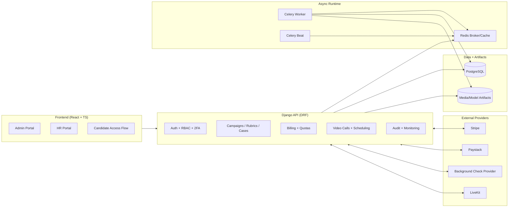
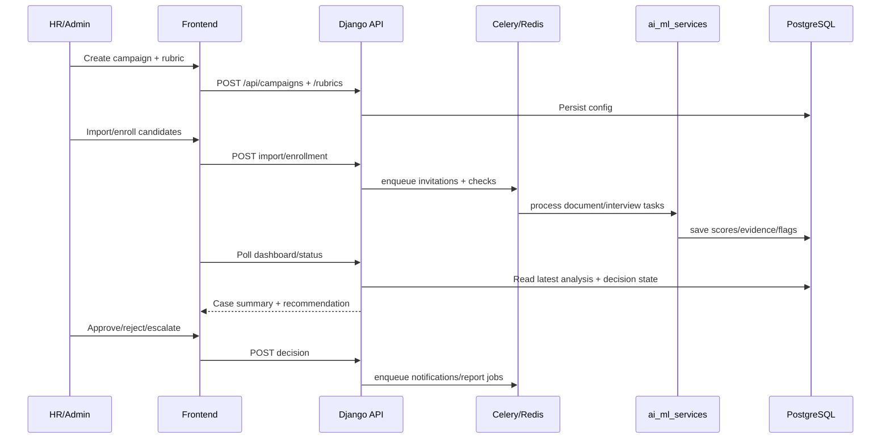

# Defense Architecture One-Pager

## 1) System Context (What the platform does)

- HR/Admin creates campaigns and rubrics.
- Candidates are enrolled and invited through secure links.
- Document + interview evidence is analyzed asynchronously.
- AI produces recommendations; final decision remains human-owned.
- Billing/subscription controls access and monthly quota.

## 2) Runtime Topology (Production-Oriented MVP)

## 3) Core Vetting Sequence (End-to-End)

## 4) Trust Boundaries and Controls

- Boundary A: Browser -> API
  - Controls: auth, role checks, CSRF/CORS constraints, 2FA flow (non-candidate accounts).
- Boundary B: API -> Async workers
  - Controls: task isolation, retry/backoff, queue-based decoupling.
- Boundary C: API -> External providers
  - Controls: signed webhook verification, idempotent state transitions, audit logs.
- Boundary D: Data storage
  - Controls: retention policy fields, immutable audit trail, quota-enforced API writes.

## 5) Failure Strategy (What happens when things go wrong)

- Provider timeout/failure: move to pending/open, retry or explicit confirm endpoint.
- Worker backlog: queue remains durable in Redis; health/runtime surfaces degraded state.
- AI low confidence: route to manual review path, not auto-fail.
- Billing webhook miss: confirm endpoint can reconcile provider state safely.

## 6) Why this architecture is defensible

- Keeps web API responsive by offloading expensive AI tasks.
- Preserves explainability with persisted evidence + model outputs.
- Supports incremental hardening without redesigning core modules.
- Aligns with launch controls in `LAUNCH_READINESS_SCORECARD_2026-03-05.md`.

## 7) 30-Second Close Statement

- "The system is architected as a production-oriented MVP: stable orchestration in Django, asynchronous AI execution with Celery/Redis, strict role-based flows, and provider-integrated billing/background checks. Remaining work is deployment hardening and operational runbooks, not core feasibility."
